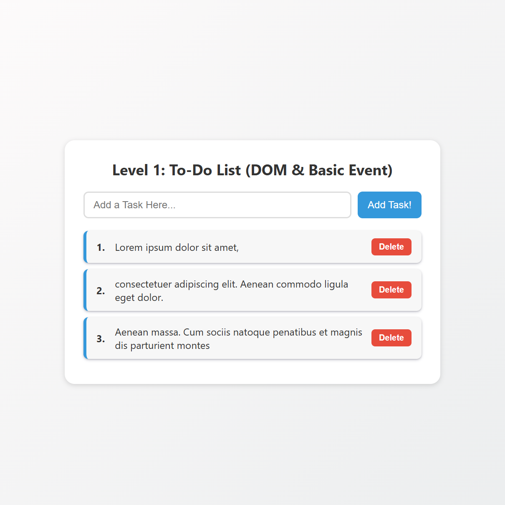

# 🧠 Level 1: To-Do List (DOM & Basic Event)

Ini adalah proyek Level 1 dari seri To-Do List yang fokus pada:
- Manipulasi DOM (Document Object Model)
- Event dasar seperti `submit` dan `click`
- Menambahkan dan menghapus task dari daftar

---

## 🎯 Fitur Utama

- Menambahkan task ke daftar dengan menekan tombol `Add Task!`
- Setiap task otomatis diberi nomor
- Tombol `Delete` untuk menghapus task
- Desain UI yang responsif dan bersih (modern card style)

---

## 🖼️ Tampilan UI

Berikut adalah tampilan dari aplikasi:

---

## 🧩 Teknologi yang Digunakan

- HTML5
- CSS3 (Responsive Design)
- JavaScript (DOM Manipulation & Events)
<!-- 
---

## 📂 Struktur Folder
 -->
