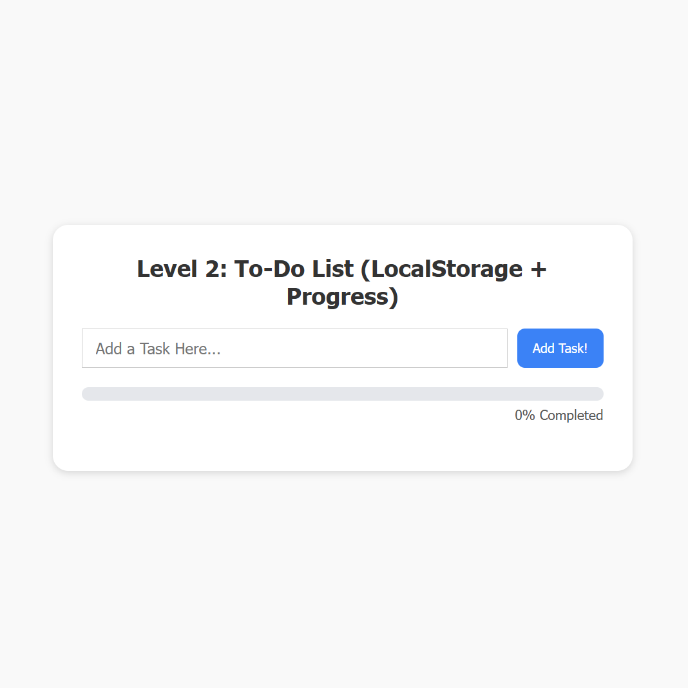
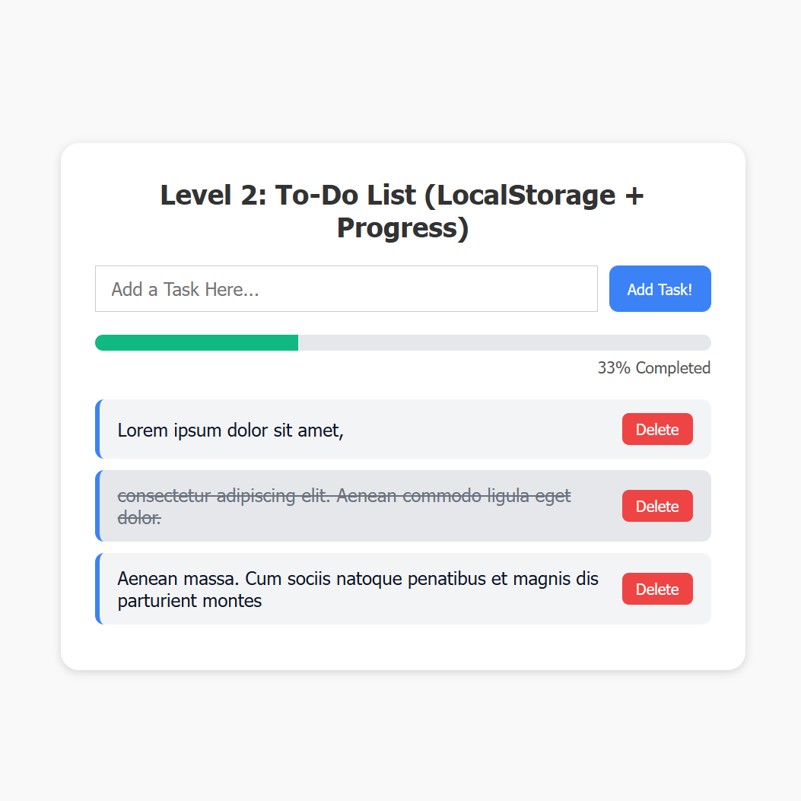

# ✅ Level 2: To-Do List (LocalStorage + Progress)

Proyek ini adalah lanjutan dari Level 1 dengan fitur yang lebih canggih dan struktur kode yang lebih profesional.  
Kita belajar bagaimana menyimpan data secara permanen di browser, serta menampilkan progress dari task yang selesai.

---

## 🎯 Fitur Utama

- [x] Menambahkan task
- [x] Menghapus task
- [x] Menandai task sebagai selesai
- [x] Menyimpan data ke localStorage
- [x] Menampilkan progress bar berdasarkan task yang selesai
- [x] Modularisasi file JavaScript (`app.js`, `storage.js`, `taskHandler.js`, `progress.js`)

---

## 🔧 Teknologi yang Digunakan

- HTML5
- CSS3 (Responsive & Clean Design)
- JavaScript (modular + localStorage)
- ES Modules (`import/export`)

---

## 📊 Progress Bar

Progress bar akan otomatis menghitung:
- Total task
- Jumlah task yang ditandai selesai
- Menampilkan persentase progress di UI

---

## 🚀 Cara Menjalankan

1. Clone repository ini atau download zip-nya.
2. Buka file `index.html` di browser (pastikan semua file berada dalam struktur folder yang benar).
3. Tambahkan task dan lihat progress-nya meningkat!

---

## 🧠 Tujuan Pembelajaran

- Modularisasi JavaScript
- Menyimpan data secara lokal di browser
- Mengelola UI dan data secara dinamis
- Meningkatkan skill DOM + struktur folder profesional

---

## 🖼️ Preview

