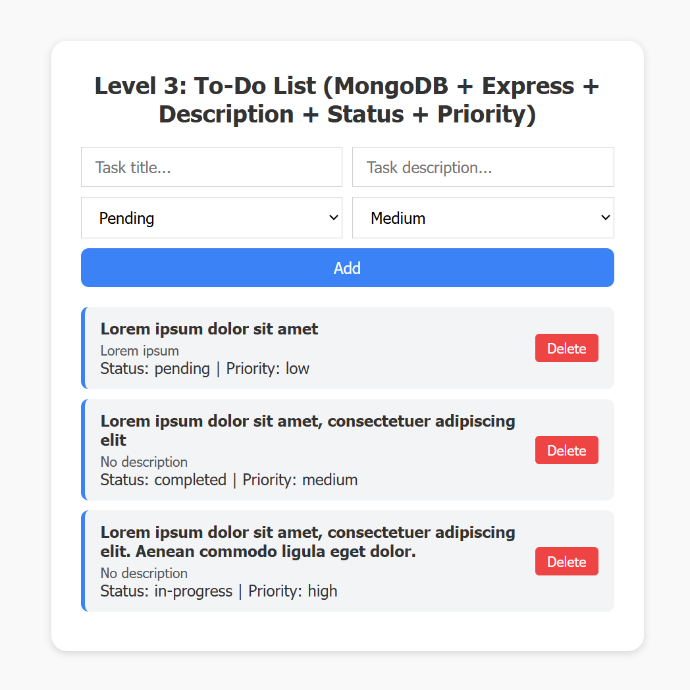

# ✅ Level 3: To-Do List (MongoDB + Express + Description + Status + Priority)

Proyek ini adalah aplikasi To-Do List yang menggunakan **MongoDB**, **Express**, dan **Frontend Dinamis**. Aplikasi ini mendukung fitur tambahan seperti deskripsi tugas, status, prioritas.

---

## 🎯 Fitur Utama

- [x] Menambahkan tugas dengan judul, deskripsi, status, dan prioritas.
- [x] Menampilkan daftar tugas dari database MongoDB.
- [x] Menghapus tugas dari daftar.
- [x] Backend REST API dengan Express.js.
- [x] Penyimpanan data menggunakan MongoDB.

---

## 🔧 Teknologi yang Digunakan

### Backend:
- **Node.js** dengan **Express.js** untuk REST API.
- **MongoDB** untuk penyimpanan data.
- **Mongoose** untuk ODM (Object Data Modeling).

### Frontend:
- **HTML5**, **CSS3**, dan **JavaScript** untuk antarmuka pengguna.
- Dinamis dengan manipulasi DOM.

---

## 🖼️ Preview
